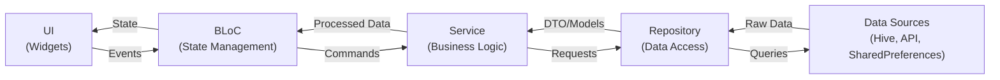

# Repository Pattern

This skill documents the layered architecture and data flow pattern used in the Floating Lyric app following the Repository Pattern.

## Architecture Overview

The app uses a clear separation of concerns with distinct layers:

```
Data Source → Repository → Service → BLoC → UI
```

### Layer Responsibilities

1. **Data Source**: Raw data storage (Hive, SharedPreferences, HTTP APIs)
2. **Repository**: Direct data access and CRUD operations
3. **Service**: Business logic and data transformation
4. **BLoC**: State management and event handling
5. **UI**: Widget rendering and user interaction

## Data Flow Diagram



## Layer Details

### 1. Data Sources

**Location**: External to the app (or in `lib/hive/`)

Raw data storage mechanisms:

- **Hive**: `Box<LrcModel>` - Local lyric database
- **SharedPreferences**: User preferences
- **HTTP Client**: API calls (e.g., LRCLib API)
- **Platform Channels**: Native Android/iOS data

**Examples**:

```dart
// Hive box
final Box<LrcModel> lrcBox;

// SharedPreferences
final SharedPreferences pref;

// HTTP client
final http.Client client;
```

### 2. Repository Layer

**Location**: `lib/repos/`

**Purpose**: Direct data access with minimal logic

**Responsibilities**:

- CRUD operations on data sources
- Simple queries and filters
- Raw data manipulation
- Error handling for data access

**Example**: `LocalDbRepo`

```dart
class LocalDbRepo {
  LocalDbRepo({required Box<LrcModel> lrcBox}) : _lrcBox = lrcBox;

  final Box<LrcModel> _lrcBox;

  // Simple data access methods
  List<LrcModel> get allRawLyrics => _lrcBox.values.toList();

  LrcModel? getLyricByID(dynamic id) => _lrcBox.get(id);

  Future<void> putLyric(LrcModel lrcDB) => _lrcBox.put(lrcDB.id, lrcDB);

  Future<void> deleteLyric(LrcModel lyric) => _lrcBox.delete(lyric.id);

  List<LrcModel> search(String searchTerm) {
    final search = searchTerm.toLowerCase().trim();
    return _lrcBox.values
        .where((e) =>
            (e.title?.toLowerCase().contains(search) ?? false) ||
            (e.artist?.toLowerCase().contains(search) ?? false))
        .toList();
  }
}
```

**Key Characteristics**:

- ✅ Direct data source access
- ✅ CRUD operations
- ✅ Simple filtering/searching
- ❌ No business logic
- ❌ No data transformation
- ❌ No complex validations

**Repository Examples in the App**:

| Repository         | Data Source          | Purpose               |
| ------------------ | -------------------- | --------------------- |
| `LocalDbRepo`      | Hive `Box<LrcModel>` | Lyric database access |
| `PreferenceRepo`   | SharedPreferences    | App settings          |
| `LrcLibRepository` | HTTP API             | Online lyric search   |

### 3. Service Layer

**Location**: `lib/services/`

**Purpose**: Business logic and data transformation

**Responsibilities**:

- Business rules and validations
- Data transformations and processing
- Coordinating multiple repositories
- Complex operations
- Generating IDs, hashing, etc.

**Example**: `LocalDbService`

```dart
class LocalDbService {
  LocalDbService({required LocalDbRepo localDBRepo})
      : _localDB = localDBRepo;

  final LocalDbRepo _localDB;

  // Business logic: Generate ID from song info
  Future<String> saveLrc({
    required String title,
    required String artist,
    String? content,
  }) async {
    // Business logic: Hash-based ID generation
    final digest = sha256.convert(utf8.encode('$title$artist$content'));
    final id = digest.toString();

    // Data transformation: Create model
    final lrcDB = LrcModel(
      id: id,
      fileName: '$title - $artist',
      title: title,
      artist: artist,
      content: content,
    );

    // Delegate to repository
    await _localDB.putLyric(lrcDB);
    return id;
  }

  // Wrapper methods with business logic
  LrcModel? getLyricBySongInfo(String title, String artist) =>
      _localDB.getLyric(title, artist);

  List<LrcModel> getAllLyrics() => _localDB.allRawLyrics;
}
```

**Key Characteristics**:

- ✅ Business logic
- ✅ Data transformation
- ✅ Validation rules
- ✅ Multi-repository coordination
- ✅ ID generation, hashing
- ❌ No state management
- ❌ No UI logic

**Service Examples in the App**:

| Service                   | Repositories Used | Purpose                     |
| ------------------------- | ----------------- | --------------------------- |
| `LocalDbService`          | `LocalDbRepo`     | Lyric business logic        |
| `LrcProcessorService`     | Multiple          | Process and parse LRC files |
| `ToOverlayMessageService` | Platform channels | Inter-app messaging         |
| `MethodChannelService`    | Platform channels | Native method calls         |

### 4. BLoC Layer

**Location**: `lib/blocs/`

**Purpose**: State management and event handling

**Responsibilities**:

- Managing UI state
- Handling user events
- Coordinating services
- Emitting state changes
- Navigation logic

**Example**: `LyricListBloc`

```dart
class LyricListBloc extends Bloc<LyricListEvent, LyricListState> {
  LyricListBloc({
    required LocalDbService localDbService,
    required LrcProcessorService lrcProcessorService,
  }) : _localDbService = localDbService,
       _lrcProcessorService = lrcProcessorService,
       super(const LyricListState()) {
    on<LyricListEvent>((event, emit) => switch (event) {
      _Started() => _onStarted(event, emit),
      _SearchUpdated() => _onSearchUpdated(event, emit),
      _DeleteRequested() => _onDeleteRequested(event, emit),
    });
  }

  final LrcProcessorService _lrcProcessorService;
  final LocalDbService _localDbService;

  Future<void> _onStarted(_Started event, Emitter<LyricListState> emit) async {
    // Call service
    final lyrics = _localDbService.getAllLyrics();

    // Emit new state
    emit(state.copyWith(lyrics: lyrics));
  }

  Future<void> _onSearchUpdated(
    _SearchUpdated event,
    Emitter<LyricListState> emit,
  ) async {
    if (event.searchTerm.isEmpty) {
      add(const _Started());
      return;
    }

    // Business coordination
    final lyrics = _localDbService.searchLyrics(event.searchTerm);
    emit(state.copyWith(lyrics: lyrics));
  }
}
```

**Key Characteristics**:

- ✅ State management
- ✅ Event handling
- ✅ Service coordination
- ✅ State emissions
- ❌ No direct data access
- ❌ No business logic
- ❌ No UI rendering

### 5. UI Layer

**Location**: `lib/apps/`, `lib/widgets/`, `lib/shells/`

**Purpose**: Rendering widgets and handling user input

**Responsibilities**:

- Widget composition
- User interaction handling
- BLoC event dispatching
- State rendering

**Example**: View layer

```dart
class _View extends StatelessWidget {
  const _View();

  @override
  Widget build(BuildContext context) {
    return BlocBuilder<LyricListBloc, LyricListState>(
      builder: (context, state) {
        // Render based on state
        return ListView.builder(
          itemCount: state.lyrics.length,
          itemBuilder: (context, index) {
            final lyric = state.lyrics[index];
            return ListTile(
              title: Text(lyric.title ?? ''),
              onTap: () {
                // Dispatch event to BLoC
                context.read<LyricListBloc>().add(
                  LyricListEvent.lyricSelected(lyric),
                );
              },
            );
          },
        );
      },
    );
  }
}
```

## Complete Flow Example

Let's trace a complete flow: **User searches for a lyric**

### Downward Flow (User → Data)

```dart
// 1. UI: User enters search text
TextField(
  onChanged: (value) {
    // 2. UI dispatches event to BLoC
    context.read<LyricListBloc>().add(
      LyricListEvent.searchUpdated(value),
    );
  },
)

// 3. BLoC handles event
Future<void> _onSearchUpdated(
  _SearchUpdated event,
  Emitter<LyricListState> emit,
) async {
  // 4. BLoC calls Service
  final lyrics = _localDbService.searchLyrics(event.searchTerm);

  // (Continues in upward flow...)
}

// 5. Service processes request
List<LrcModel> searchLyrics(String searchTerm) {
  // 6. Service calls Repository
  return _localDB.search(searchTerm);
}

// 7. Repository queries Data Source
List<LrcModel> search(String searchTerm) {
  final search = searchTerm.toLowerCase().trim();

  // 8. Access Hive box
  return _lrcBox.values
      .where((e) => /* filter logic */)
      .toList();
}
```

### Upward Flow (Data → UI)

```dart
// 7. Repository returns data to Service
return _lrcBox.values.where(...).toList();

// 6. Service returns data to BLoC
return _localDB.search(searchTerm);

// 5. BLoC emits new state
emit(state.copyWith(lyrics: lyrics));

// 4. UI rebuilds with new state
BlocBuilder<LyricListBloc, LyricListState>(
  builder: (context, state) {
    // 3. Render filtered lyrics
    return ListView.builder(
      itemCount: state.lyrics.length,
      itemBuilder: (context, index) {
        return LyricListItem(lyric: state.lyrics[index]);
      },
    );
  },
)
```

## Dependency Injection

Dependencies flow from outer to inner layers:

```dart
// 1. Create Data Sources (main.dart)
final lrcBox = await Hive.openBox<LrcModel>('lrc');
final pref = await SharedPreferences.getInstance();

// 2. Create Repositories (App Dependency layer)
final localDbRepo = LocalDbRepo(lrcBox: lrcBox);
final preferenceRepo = PreferenceRepo(pref: pref);

// 3. Create Services
final localDbService = LocalDbService(localDBRepo: localDbRepo);

// 4. Create BLoCs
final lyricListBloc = LyricListBloc(
  localDbService: localDbService,
  lrcProcessorService: lrcProcessorService,
);

// 5. Provide to UI
BlocProvider.value(
  value: lyricListBloc,
  child: LyricListPage(),
)
```

## Best Practices

### Repository Layer

✅ **DO**:

- Keep methods simple and focused
- Return raw data or models
- Handle data source errors
- Use descriptive method names

❌ **DON'T**:

- Add business logic
- Transform data extensively
- Validate business rules
- Manage state

### Service Layer

✅ **DO**:

- Implement business logic
- Transform and validate data
- Coordinate multiple repositories
- Return domain models
- Handle business errors

❌ **DON'T**:

- Directly access data sources
- Manage UI state
- Handle navigation
- Render UI

### BLoC Layer

✅ **DO**:

- Manage state
- Handle events
- Call services
- Emit state changes
- Handle navigation logic

❌ **DON'T**:

- Access repositories directly
- Implement business logic
- Render widgets
- Access data sources

### UI Layer

✅ **DO**:

- Render widgets
- Dispatch events
- Read state
- Handle user input

❌ **DON'T**:

- Call services directly
- Access repositories
- Implement business logic
- Manage complex state

## Common Patterns

### Pattern 1: Simple CRUD

```dart
// Repository: Direct access
Future<void> putLyric(LrcModel lyric) => _box.put(lyric.id, lyric);

// Service: Add business logic
Future<String> saveLrc({required String title, required String artist}) {
  final id = generateId(title, artist);
  final model = LrcModel(id: id, title: title, artist: artist);
  await _repo.putLyric(model);
  return id;
}

// BLoC: Coordinate and emit
Future<void> _onSave(SaveEvent event, Emitter emit) async {
  emit(state.copyWith(isLoading: true));
  final id = await _service.saveLrc(title: event.title, artist: event.artist);
  emit(state.copyWith(isLoading: false, savedId: id));
}
```

### Pattern 2: Multi-Repository Service

```dart
class LrcProcessorService {
  LrcProcessorService({
    required LocalDbRepo localDbRepo,
    required LrcLibRepository lrcLibRepo,
  });

  Future<LrcModel> fetchAndSave(String title, String artist) async {
    // 1. Fetch from API
    final onlineLrc = await _lrcLibRepo.search(title, artist);

    // 2. Transform
    final model = LrcModel.fromApi(onlineLrc);

    // 3. Save locally
    await _localDbRepo.putLyric(model);

    return model;
  }
}
```

### Pattern 3: Complex State Management

```dart
// BLoC coordinates multiple services
class ImportBloc extends Bloc<ImportEvent, ImportState> {
  ImportBloc({
    required LocalDbService dbService,
    required LrcProcessorService processorService,
    required FilePickerService fileService,
  });

  Future<void> _onImport(ImportEvent event, Emitter emit) async {
    // 1. Pick files
    final files = await _fileService.pickFiles();

    // 2. Process files
    final lyrics = await _processorService.processFiles(files);

    // 3. Save to database
    await _dbService.saveBatch(lyrics);

    // 4. Emit success
    emit(state.copyWith(status: ImportStatus.success));
  }
}
```

## Testing Benefits

The layered architecture makes testing easier:

```dart
// Test Repository: Mock data source
test('LocalDbRepo.getLyric returns correct lyric', () {
  final mockBox = MockBox<LrcModel>();
  final repo = LocalDbRepo(lrcBox: mockBox);
  // ...
});

// Test Service: Mock repository
test('LocalDbService.saveLrc generates correct ID', () {
  final mockRepo = MockLocalDbRepo();
  final service = LocalDbService(localDBRepo: mockRepo);
  // ...
});

// Test BLoC: Mock service
blocTest<LyricListBloc, LyricListState>(
  'emits lyrics when search updated',
  build: () {
    final mockService = MockLocalDbService();
    return LyricListBloc(localDbService: mockService);
  },
  // ...
);
```

## Related Skills

- [Page Architecture](../page-architecture/SKILL.md) - Page structure with dependency injection
- [BLoC Structure](../../state-management/bloc-structure/SKILL.md) - BLoC organization
- [Code Conventions](../../development/code-conventions/SKILL.md) - Naming and organization
