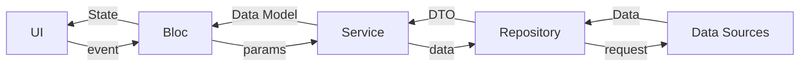
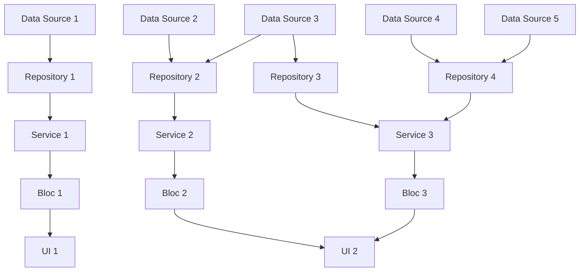
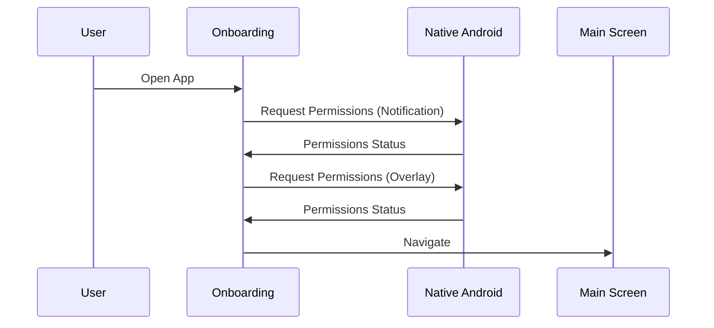
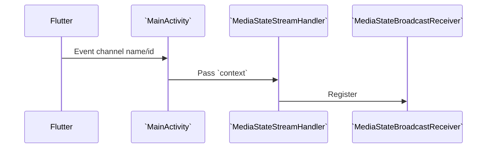
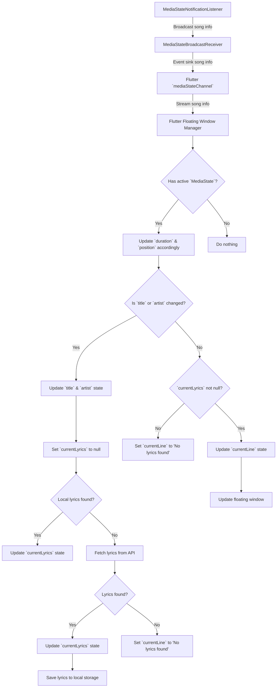
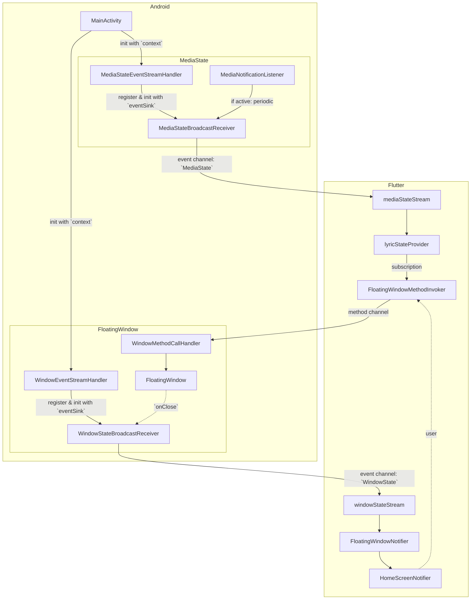

# Workflow Diagrams for Floating Lyrics App

## Project Structure (v4.0.0+20)

### High Level Overview

### A Slightly More Complex Situation

---
> ⚠️⚠️⚠️
> **Deprecation Notice:**
> **Below may need to be updated according to the latest breaking changes (v4.0.0).**

## 1. Onboarding + Permissions

## 2. Set Up Event Channel of `MediaState`

## Lyric Update Workflow

## Flutter x Android Communication

