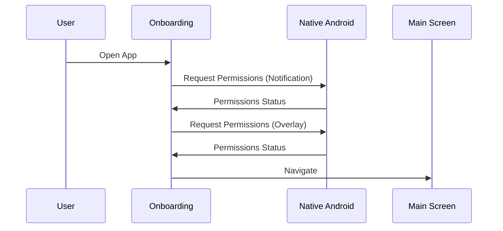
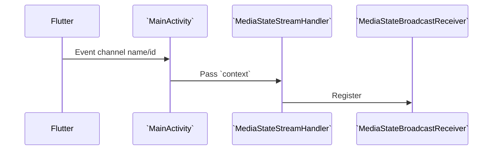
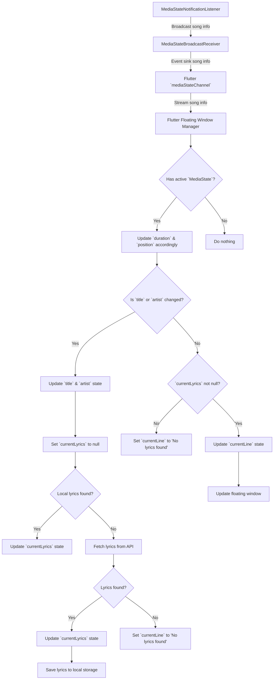
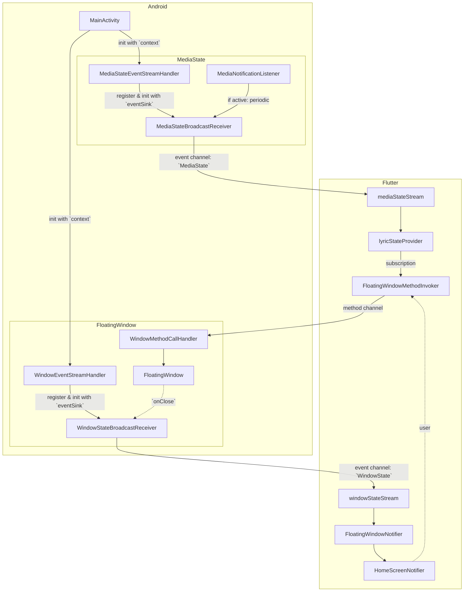

# Workflow Diagrams for Floating Lyrics App

## 1. Onboarding + Permissions

```mermaid
sequenceDiagram
    participant A as User
    participant B as Onboarding
    participant C as Native Android
    participant D as Main Screen
    A->>B: Open App
    B->>C: Request Permissions (Notification)
    C->>B: Permissions Status
    B->>C: Request Permissions (Overlay)
    C->>B: Permissions Status
    B->>D: Navigate
```

## 2. Set Up Event Channel of `MediaState`

```mermaid
sequenceDiagram
    participant A as Flutter
    participant B as `MainActivity`
    participant C as `MediaStateStreamHandler`
    participant D as `MediaStateBroadcastReceiver`

    A->>B: Event channel name/id
    B->>C: Pass `context`
    C->>D: Register
```

## Lyric Update Workflow

```mermaid
flowchart TD
    A[MediaStateNotificationListener] --> |Broadcast song info | B[MediaStateBroadcastReceiver]
    B --> |Event sink song info | C[Flutter `mediaStateChannel`]
    C --> |Stream song info | D[Flutter Floating Window Manager]
    D --> E{Has active `MediaState`?}
    E --> |Yes| F[Update `duration` & `position` accordingly]
    E --> |No| G[Do nothing]
    F --> H{Is `title` or `artist` changed?}
    H --> |No| I{`currentLyrics` not null?}
    I --> |Yes| J[Update `currentLine` state]
    I --> |No| K[Set `currentLine` to 'No lyrics found']
    H --> |Yes| L1[Update `title` & `artist` state]
    L1 --> L2[Set `currentLyrics` to null]
    L2 --> M{Local lyrics found?}
    M --> |Yes| N[Update `currentLyrics` state]
    M --> |No| O[Fetch lyrics from API]
    O --> P{Lyrics found?}
    P --> |Yes| Q[Update `currentLyrics` state]
    Q --> R[Save lyrics to local storage]
    P --> |No| S[Set `currentLine` to 'No lyrics found']
    J --> T[Update floating window]
```

## Flutter x Android Communication

```mermaid
flowchart TD

    subgraph Flutter
        mediaStateStream["mediaStateStream"]
        windowStateStream["windowStateStream"]
        floatingWindowNotifier["FloatingWindowNotifier"]
        homeScreenNotifier["HomeScreenNotifier"]
        methodInvoker["FloatingWindowMethodInvoker"]
        lyricStateProvider["lyricStateProvider"]

        windowStateStream --> floatingWindowNotifier
        floatingWindowNotifier --> homeScreenNotifier

        mediaStateStream --> lyricStateProvider
        lyricStateProvider --> | subscription | methodInvoker
        homeScreenNotifier -.-> | user | methodInvoker
    end

    subgraph Android
        mainActivity["MainActivity"]

        subgraph FloatingWindow
            floatingWindow["FloatingWindow"]
            windowEventStreamHandler["WindowEventStreamHandler"]
            methodCallHandler["WindowMethodCallHandler"]
            windowStateBroadcastReceiver["WindowStateBroadcastReceiver"]

            windowEventStreamHandler --> | register & init with `eventSink` | windowStateBroadcastReceiver
            methodCallHandler --> floatingWindow
            floatingWindow -.-> | `onClose` | windowStateBroadcastReceiver
        end

        subgraph MediaState
            mediaNotificationListener["MediaNotificationListener"]
            mediaStateStreamHandler["MediaStateEventStreamHandler"]
            mediaStateBroadcastReceiver["MediaStateBroadcastReceiver"]

            mediaStateStreamHandler --> | register & init with `eventSink` | mediaStateBroadcastReceiver
            mediaNotificationListener --> | if active: periodic | mediaStateBroadcastReceiver
        end
    end

    mainActivity --> | init with `context` | windowEventStreamHandler
    mainActivity --> | init with `context` | mediaStateStreamHandler

    windowStateBroadcastReceiver --> | event channel: `WindowState` | windowStateStream
    mediaStateBroadcastReceiver --> | event channel: `MediaState` | mediaStateStream

    methodInvoker --> | method channel | methodCallHandler

```
