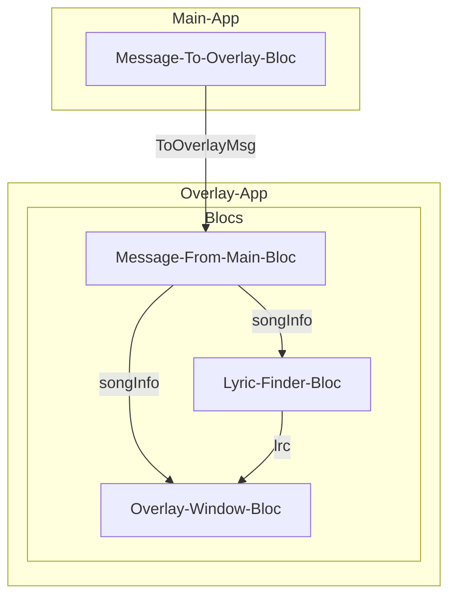

# Overlay App Architecture

The overlay app is a standalone Flutter app that runs in a separate isolate. It is responsible for displaying the floating lyric window and handling user interactions with it.

The architecture of the overlay app is designed to be modular and scalable. It consists of the following layers:

