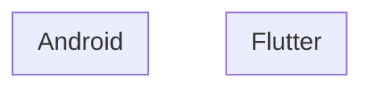
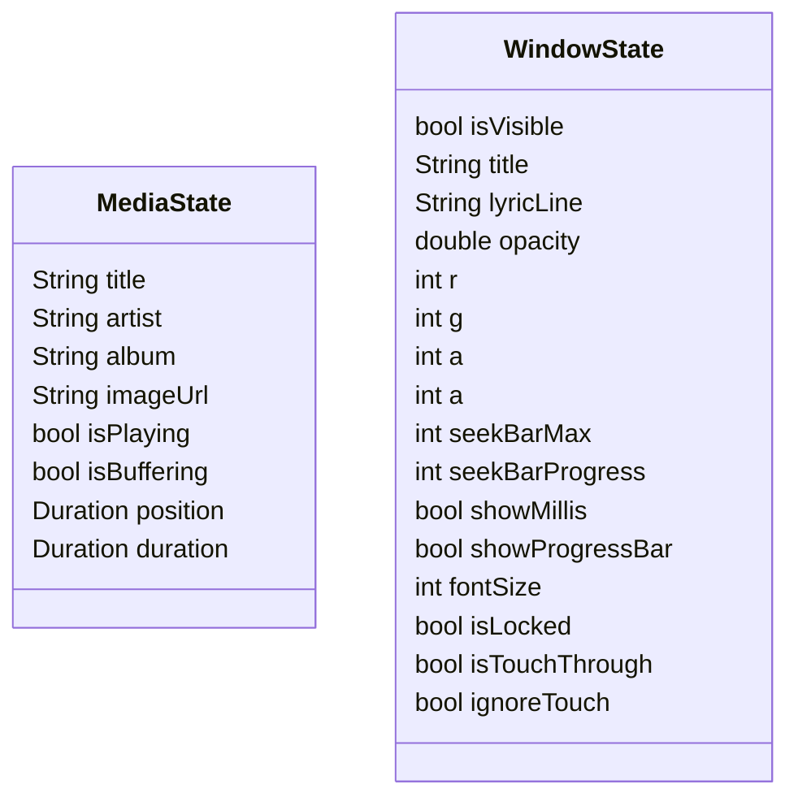

# V4.0.0 Architecture

## Overview

```mermaid
flowchart

    subgraph Flutter
    end

    subgraph "Android"
    end
```

## States

```mermaid
classDiagram

class MediaState {
    String title
    String artist
    String album
    String imageUrl
    bool isPlaying
    bool isBuffering
    Duration position
    Duration duration
}

class WindowState {
    bool isVisible
    String title
    String lyricLine
    double opacity
    int r
    int g
    int a
    int a
    int seekBarMax
    int seekBarProgress
    bool showMillis
    bool showProgressBar
    int fontSize
    bool isLocked
    bool isTouchThrough
    bool ignoreTouch
}
```
